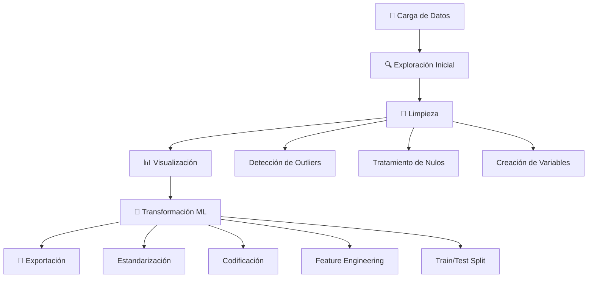

# 🥑 Análisis de Datos de Aguacates - EDA & Machine Learning

[](https://www.python.org/downloads/)
[](LICENSE)
[]()

> **Análisis exploratorio completo y preparación de datos para modelos predictivos de precios de aguacates en Estados Unidos**

---

## 📑 Tabla de Contenidos

- [Descripción](#-descripción)
- [Características](#-características)
- [Estructura del Proyecto](#-estructura-del-proyecto)
- [Instalación](#-instalación)
- [Uso](#-uso)
- [Pipeline de Datos](#-pipeline-de-datos)
- [Visualizaciones](#-visualizaciones)
- [Tecnologías](#-tecnologías)
- [Resultados](#-resultados)
- [Contacto](#-contacto)

---

## Descripción

Este proyecto implementa un **pipeline completo de análisis de datos** sobre un dataset de precios y volúmenes de venta de aguacates Hass en diferentes regiones de Estados Unidos. El objetivo es limpiar, explorar, visualizar y preparar los datos para aplicar técnicas de **Machine Learning** que permitan:

-  Predecir precios futuros de aguacates
-  Identificar patrones de consumo por región
-  Analizar estacionalidad y tendencias
-  Segmentar mercados por tipo de aguacate

---

##  Características

###  Procesamiento de Datos
- Carga automática y validación de tipos de datos
- Detección y tratamiento de valores nulos
- Eliminación de outliers mediante método IQR
- Creación de variables derivadas (feature engineering)

###  Transformaciones Avanzadas
-  Estandarización (StandardScaler) y normalización (MinMaxScaler)
-  Codificación de variables categóricas (Label & One-Hot Encoding)
-  Generación de 8 nuevas variables para ML
-  División automática en conjuntos de entrenamiento y prueba

###  Visualizaciones
-  **13 gráficos interactivos** con navegador personalizado
-  Guardado automático en alta resolución (300 DPI)
-  Análisis de correlaciones, distribuciones y tendencias
-  Interfaz con botones de navegación

###  Automatización
-  Pipeline completamente automatizado
-  Exportación de dataset limpio en CSV
-  Código modular y reutilizable

---

## 📁 Estructura del Proyecto

```
PROYECTO_DATOS_EDA/
│
├── 📂 data/
│   ├── avocado.csv              # Dataset original
│   └── avocado_limpio.csv       # Dataset procesado (generado)
│
├── 📂 graficos/                  # Gráficos exportados (generados)
│   ├── 01_histograma_precio.png
│   ├── 02_boxplot_volumen.png
│   └── ...
│
├── 📂 src/
│   ├── carga_datos.py           # Módulo de carga inicial
│   ├── exploracion.py           # Análisis exploratorio
│   ├── limpieza_datos.py        # Limpieza y detección de outliers
│   ├── transformacion_datos.py  # Transformaciones y ML prep
│   │
│   └── 📂 DefiniciónProblemas/
│       └── DiseñoGráficos.py    # Sistema de visualización
│
├── main.py                       # Script principal
├── requirements.txt              # Dependencias
└── README.md                     # Este archivo
```

---


### Dependencias Principales

```txt
pandas>=1.5.0
numpy>=1.23.0
matplotlib>=3.5.0
seaborn>=0.12.0
scikit-learn>=1.1.0
```

---

## 🚀 Uso

### Ejecución Completa

Para ejecutar todo el pipeline de análisis:

```bash
python main.py
```

### Salida Esperada

```
======================================================================
🥑 ANÁLISIS DE DATOS - AGUACATES
======================================================================

📂 Paso 1: Cargando datos...
✓ Datos cargados: 18249 filas × 14 columnas

🔍 Paso 2: Exploración inicial de datos...
[Estadísticas descriptivas...]

🧹 Paso 3: Limpieza de datos...
✓ Variable 'total_bags' creada
✓ Variable 'total_volume' creada
✓ Limpieza completada: 16593 filas × 16 columnas
💾 Archivo 'data/avocado_limpio.csv' guardado correctamente

📊 Paso 4: Lanzando Visor de Gráficos Interactivo...
[Navegador de gráficos se abre...]

🔧 Paso 5: Transformación de datos para Machine Learning...
🎯 Dataset listo para Machine Learning:
  - X_train: (13274, 70)
  - X_test: (3319, 70)
  - y_train: (13274,)
  - y_test: (3319,)

======================================================================
✅ PROCESO COMPLETADO EXITOSAMENTE
======================================================================
```

### Uso de Módulos Individuales

```python
from src.carga_datos import cargar_datos
from src.exploracion import explorar_datos
from src.limpieza_datos import eliminar_outliers

# Cargar datos
df = cargar_datos()

# Explorar
explorar_datos(df)

# Limpiar outliers
df_limpio = eliminar_outliers(df, columnas=['AveragePrice', 'Total Volume'])
```

---

## 🔄 Pipeline de Datos



### Detalle de Cada Etapa

| Etapa | Descripción | Métodos Utilizados |
|-------|-------------|-------------------|
| **Carga** | Importa CSV y convierte tipos | `pd.read_csv()`, `pd.to_numeric()` |
| **Exploración** | Estadísticas descriptivas y nulos | `df.describe()`, `df.info()` |
| **Limpieza** | Elimina outliers (IQR) y nulos | Método IQR, `dropna()` |
| **Visualización** | 13 gráficos interactivos | Seaborn, Matplotlib |
| **Transformación** | Prepara para ML | StandardScaler, LabelEncoder |
| **Split** | Divide en train/test (80/20) | `train_test_split()` |

---

## Visualizaciones

El proyecto genera **13 gráficos profesionales**:

| # | Visualización | Tipo | Insights |
|---|---------------|------|----------|
| 1 | Distribución de Precio | Histograma + KDE | Precio medio ~$1.40 |
| 2 | Outliers en Volumen | Boxplot | Identifica valores extremos |
| 3 | Precio por Tipo | Boxplot Agrupado | Organic 40% más caro |
| 4 | Tendencia Temporal | Línea | Estacionalidad clara |
| 5 | Volumen por Tipo | Líneas Múltiples | Conventional domina |
| 6 | Distribución de Bolsas | Barras | Small Bags más popular |
| 7 | Matriz de Correlación | Heatmap | Relaciones entre variables |
| 8 | Top 15 Regiones | Barras Horizontales | Hartford más caro |
| 9 | Códigos PLU | Barras | PLU 4046 domina |
| 10 | Observaciones por Región | Countplot | West más datos |
| 11 | Heatmap Avanzado | Heatmap Específico | Correlaciones clave |
| 12 | Volatilidad por Año | Violin Plot | 2017 más volátil |
| 13 | IQR Regional | Barras | Regiones más variables |

### Navegador Interactivo

El sistema incluye botones de navegación:

```
[<< Anterior]  Gráfico 5 de 13  [Siguiente >>]
```

---

## Tecnologías

### Lenguajes y Librerías

- **Python 3.8+**: Lenguaje principal
- **Pandas**: Manipulación de datos
- **NumPy**: Operaciones numéricas
- **Matplotlib**: Visualización base
- **Seaborn**: Visualizaciones estadísticas
- **Scikit-learn**: Transformaciones y ML

### Herramientas de Desarrollo

- **Git**: Control de versiones
- **Jupyter Notebook**: Prototipado (opcional)
- **VS Code**: Editor recomendado

---

##  Resultados

### Limpieza de Datos

- **Registros originales**: 18,249
- **Registros finales**: 16,593 (8.3% eliminado)
- **Valores nulos eliminados**: 100%
- **Outliers tratados**: AveragePrice, Total Volume

### Variables Generadas

**Variables derivadas básicas:**
- `total_bags`: Suma de Small, Large y XLarge Bags
- `total_volume`: Volumen total de ventas

**Variables de Feature Engineering (8):**
- `bags_ratio`: Proporción de bolsas
- `price_per_volume`: Precio por unidad
- `small_bag_dominance`, `large_bag_dominance`: Dominancia de tamaño
- `month`, `quarter`, `week_of_year`: Variables temporales
- `total_plu_volume`: Suma de códigos PLU
- `type_price_interaction`: Interacción tipo-precio

**Variables transformadas:**
- 2 estandarizadas (StandardScaler)
- 3 normalizadas (MinMaxScaler)
- 1 codificada (Label Encoding)
- ~50 one-hot encoded (regiones)

### Dataset Final para ML

```
Features (X): 70 columnas
Target (y): AveragePrice
Train: 13,274 muestras (80%)
Test: 3,319 muestras (20%)
```

### Áreas de Mejora

- [ ] Implementar modelos de Machine Learning (Random Forest, XGBoost)
- [ ] Dashboard interactivo con Streamlit
- [ ] Análisis de series temporales (ARIMA, Prophet)
- [ ] Tests unitarios con pytest
- [ ] Documentación con Sphinx
- [ ] CI/CD con GitHub Actions

---

**Autores:** [Hugo, Antonio Cuadrado Márquez, Santiago Gotor Amado]


<div align="center">
  <strong>⭐ Si este proyecto te fue útil, considera darle una estrella en GitHub ⭐</strong>
</div>


